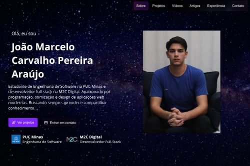
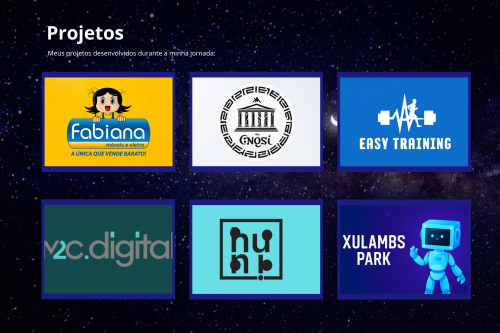
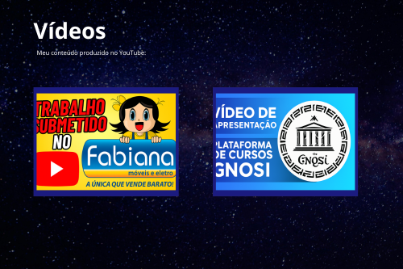
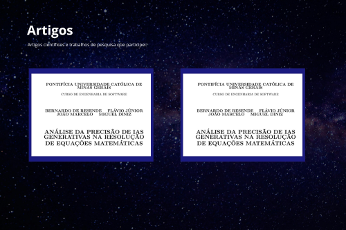
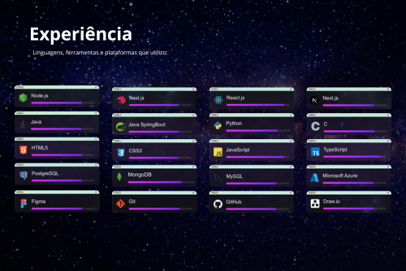
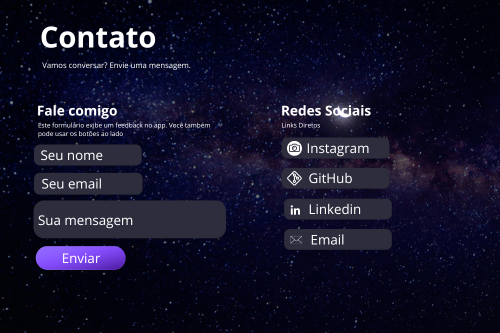

#  👨‍💻 Portfólio Pessoal - João Marcelo

 **Clique aqui:** [Link do Portfólio](https://joaomarcelocpa.vercel.app)

## 📋 Sobre o Projeto

Este é meu portfólio pessoal desenvolvido em Next.js, a mais moderna tecnologia de desenvolvimento Web. O site apresenta uma experiência visual imersiva com animações fluidas, design responsivo e uma interface intuitiva que destaca meus projetos, experiência e artigos científicos, além de uma seção para entrar em contato comigo.

## 🛠️ Como Executar Localmente

### Pré-requisitos

Certifique-se de ter instalado em sua máquina:
- [Node.js](https://nodejs.org/) (versão 18.18.0 ou superior)
- [npm](https://www.npmjs.com/) ou [yarn](https://yarnpkg.com/)

### Passos para execução

1. **Clone o repositório**
   ```bash
   git clone https://github.com/joaomarcelocpa/portfolio.git
   cd portfolio
   ```

2. **Instale as dependências**
   ```bash
   npm install
   # ou
   yarn install
   ```

3. **Execute o servidor de desenvolvimento**
   ```bash
   npm run dev
   # ou
   yarn dev
   ```

4. **Acesse a aplicação**
   
   Abra [http://localhost:3000](http://localhost:3000) no seu navegador para ver o resultado.

## ✨ Características Principais

- **Design Moderno**: Interface com tema espacial utilizando vídeo de fundo e animações de estrelas
- **Totalmente Responsivo**: Adaptado para todos os dispositivos e tamanhos de tela
- **Animações Fluidas**: Implementadas with Framer Motion para uma experiência suave
- **Componentes Reutilizáveis**: Arquitetura modular com componentes bem estruturados
- **Performance Otimizada**: Construído com Next.js 15 e otimizações de imagem
- **Acessibilidade**: Seguindo boas práticas de acessibilidade web

## 🏗️ Tecnologias Utilizadas

### Frontend


### Bibliotecas e Ferramentas
- **Framer Motion** - Animações e transições
- **Radix UI** - Componentes acessíveis
- **Lucide React** - Ícones modernos
- **Class Variance Authority** - Utilitário para variantes de componentes
- **Tailwind Merge** - Otimização de classes CSS

## 📁 Estrutura Detalhada do Projeto

```
portfolio/
├── public/                          # Arquivos estáticos
│   ├── logos/                       # Imagens de logos e perfil
│   ├── projects/                    # Imagens dos projetos
│   ├── articles/                    # PDFs dos artigos
│   └── wireframes/                  # Wireframes das seções
├── src/
│   ├── app/                        # App Router do Next.js 15
│   │   ├── globals.css             # Estilos globais e animações customizadas
│   │   ├── layout.tsx              # Layout raiz com metadados e fontes
│   │   └── page.tsx                # Página principal com gerenciamento de estado
│   ├── components/                 # Componentes React organizados por categoria
│   │   ├── cards/                  # Cards especializados para diferentes conteúdos
│   │   │   ├── article-card.tsx    # Card com preview de PDF e modal
│   │   │   ├── project-card.tsx    # Card de projeto com modal detalhado
│   │   │   ├── skill-card.tsx      # Card de habilidade com animação
│   │   │   └── video-card.tsx      # Card com iframe do YouTube
│   │   ├── layout/                 # Componentes de layout e navegação
│   │   │   ├── back-to-top.tsx     # Botão de voltar ao topo
│   │   │   ├── navbar.tsx          # Navegação responsiva com menu mobile
│   │   │   ├── reveal.tsx          # Animação de entrada com Framer Motion
│   │   │   ├── section.tsx         # Wrapper para seções da página
│   │   │   └── stars-canvas.tsx    # Canvas com animação de estrelas
│   │   ├── sections/               # Seções principais da página
│   │   │   ├── articles-section.tsx    # Exibição de artigos científicos
│   │   │   ├── contact-section.tsx     # Formulário de disparo de email e redes sociais
│   │   │   ├── experience-section.tsx  # Grade de habilidades técnicas
│   │   │   ├── footer-section.tsx      # Rodapé com informações acadêmicas
│   │   │   ├── hero-section.tsx        # Apresentação principal
│   │   │   ├── projects-section.tsx    # Showcase de projetos
│   │   │   └── videos-section.tsx      # Galeria de vídeos do YouTube
│   │   └── ui/                     # Componentes de UI reutilizáveis (Radix)
│   │       ├── badge.tsx           # Componente de badge/etiqueta
│   │       ├── button.tsx          # Botão com múltiplas variantes
│   │       ├── card.tsx            # Estrutura base de cards
│   │       ├── dialog.tsx          # Modal/diálogo acessível
│   │       ├── input.tsx           # Campo de entrada de texto
│   │       ├── language-selector.tsx  # Seletor de idioma
│   │       ├── separator.tsx       # Linha separadora visual
│   │       ├── sheet.tsx           # Painel lateral (menu mobile)
│   │       ├── textarea.tsx        # Área de texto para formulários
│   │       ├── toast.tsx           # Sistema de notificações
│   │       └── toaster.tsx         # Provider para gerenciar toasts
│   ├── hooks/                      # Custom hooks
│   │   └── use-toast.tsx           # Hook para sistema de notificações
│   ├── contexts/                   # Contextos 
│   │   └── linguage-context.tsx    # Arquivo de traduções dos textos
│   └── lib/                        # Utilitários e helpers
│       └── emailjs.ts              # Função para validar credenciais do EmailJS
│       └── utils.ts                # Função para combinar classes CSS
```

## 🎨 Seções do Portfólio com Protótipos

> **Acesse os protótipos e wireframes por meio desse link:** [Link do Meu Figma](https://www.figma.com/design/21GuAHTi0qqtOKIIUOgVXq/Sem-t%C3%ADtulo?node-id=0-1&t=3DIdvc9iWeOYuHRM-1)

### 🏠 **Hero Section**
Apresentação pessoal com foto, descrição profissional e links para redes sociais



### 💼 **Projetos**
Showcase dos principais projetos desenvolvidos durante minha trajetória como desenvolvedor com cards interativos e modais detalhados



### 🎥 **Vídeos**
Demonstrações em vídeo dos projetos desenvolvidos, integradas diretamente do YouTube



### 📚 **Artigos**
Artigos científicos e trabalhos de pesquisa com visualização de PDF integrada



### 💻 **Experiência**
Showcase das tecnologias e ferramentas que domino, com indicadores visuais de proficiência



### 📞 **Contato**
Formulário de contato funcional e links diretos para redes sociais




## ⚡ Performance

- ✅ **Core Web Vitals** otimizados
- ✅ **Lazy Loading** de imagens e componentes
- ✅ **Code Splitting** automático
- ✅ **Compressão** de assets
- ✅ **Otimização** de fontes com next/font

## 🔧 Features Técnicas

- 🎨 **Video Background** - Fundo de vídeo de galáxia imersivo
- 🌟 **Canvas Animation** - Animação de estrelas customizada
- 📱 **PWA Ready** - Preparado para instalação como app
- 🔄 **Auto-scroll** - Navegação suave entre seções
- 🔍 **SEO Optimized** - Meta tags e estrutura otimizada
- 📊 **Intersection Observer** - Detecção de seções visíveis

## 🌐 Redes Sociais

[](https://instagram.com/joaomarcelocpa/)
[](https://www.linkedin.com/in/joaomarcelocpa/)
[](https://github.com/joaomarcelocpa/)
[](mailto:joaomarcelocpa0303@gmail.com)

## 🙋‍♂️ Sobre Mim

Sou estudante de **Engenharia de Software** na **PUC Minas** e desenvolvedor **Full-Stack** na **M2C Digital**. Apaixonado por tecnologia, sempre buscando aprender novas ferramentas e compartilhar conhecimento através de projetos open source.

---

<div align="center">
  <p>© 2025 - Todos os direitos reservados</p>
  
  ⭐ **Se gostou do projeto, deixe uma estrela!** ⭐
</div>
